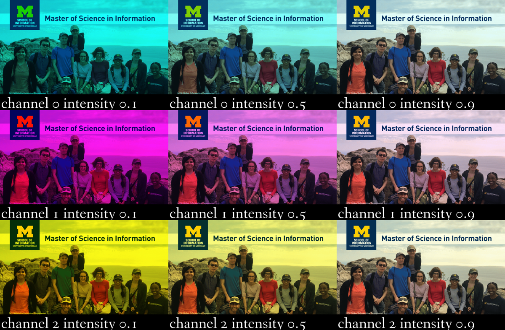

# Pillow Contact Sheet Project

This is a project part of the Python 3 Programming Specialization in Coursera. This project takes one image as an input, and using the pillow library in Python creates a contact sheet that changes the RGB values. See the next example:

